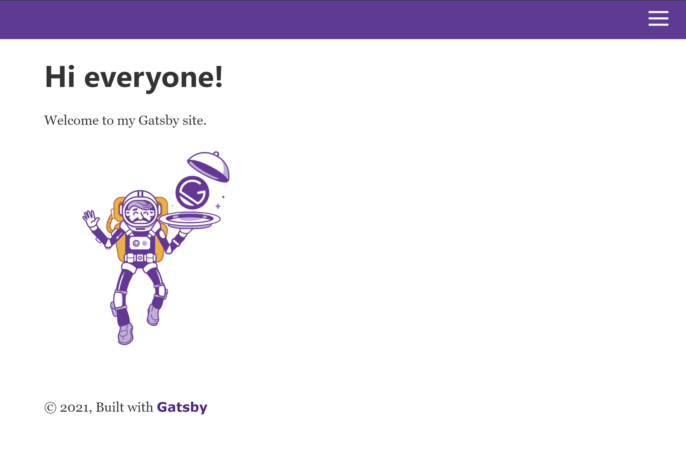
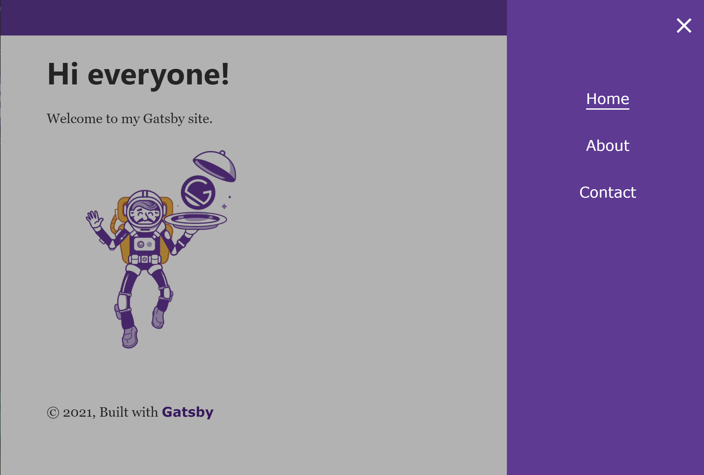
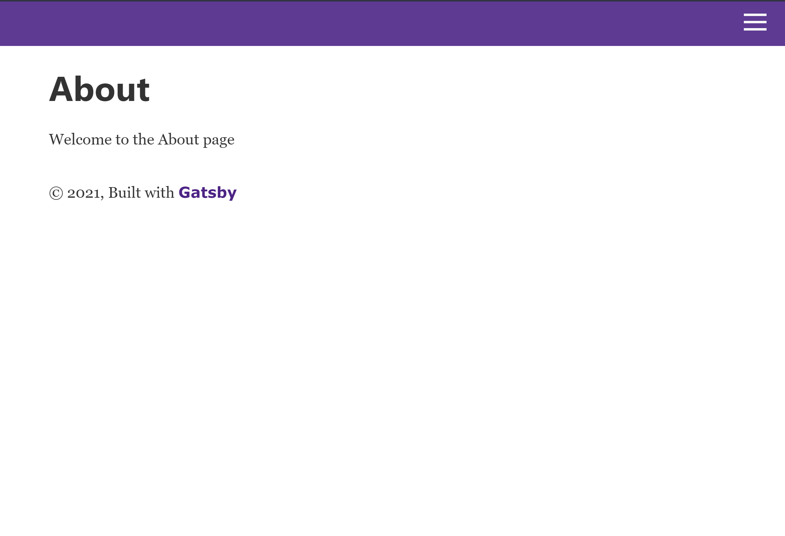
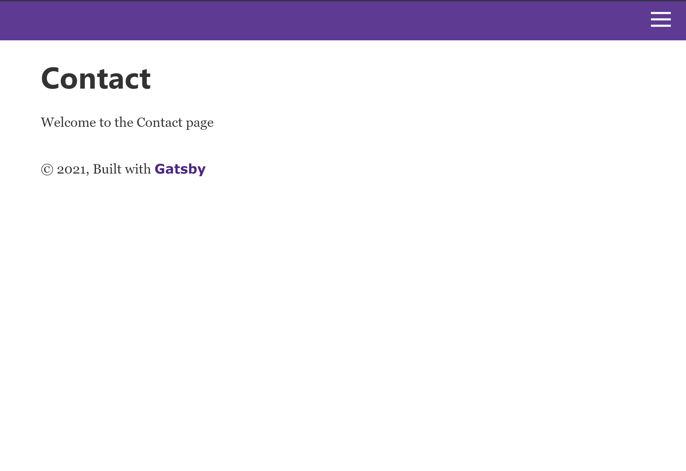

<h1>Hamburger Menu with Gatsby </h1>

*Hamburger menu built with Gatsby using npm package react-burger-menu*
  - create Gatsby site with [gatsby-default-starter](https://github.com/gatsbyjs/gatsby-starter-default)
  - add pages (About, Contact)
  - install [react-burger-menu](https://github.com/negomi/react-burger-menu) with npm
  - add Menu code to menu component (menu.js)
  - customize styling to match Gatsby starter

<h2>- Home Page-</h2>
  

<h2>- Open Menu -</h2>
  

<h2>- About Page -</h2>
    

<h2>- Contact Page  -</h2>
  